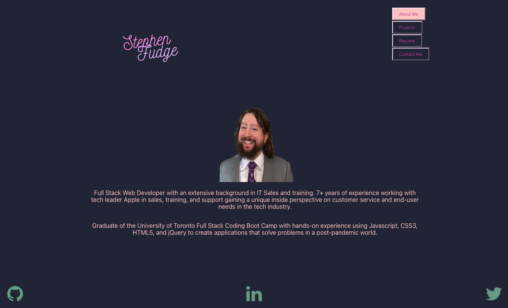

# reimagined-giggle

## React Portfolio - Challenge Assignment 20 React

## Description

This project is a Portfolio created using React.JS. It will be updated with new and exciting projects regularly. 

## Installation

*What are the steps required to install your project? Provide a step-by-step description of how to get the development environment running.*

download everything, do an 'npm install' then 'npm start' and it should load the page on a localhost.

## Usage

*Provide instructions and examples for use. Include screenshots as needed.*

To provide prospective employers somewhere to go to look at my previous work, as well as, view my resume.

Below is a screenshot of what the page will look like upon entry. 

## Links
Here is a link to my [Portfolio](https://stephenfudge.github.io/reimagined-giggle/)
